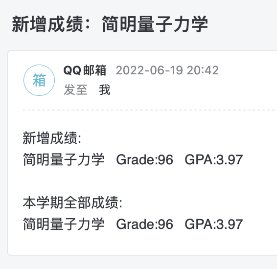

# GPA-Checker-for-PKUer

- 在[@ctlllll](https://github.com/ctlllll)前辈的代码基础上修改而成
- 基于python3的自动查分脚本，自己运行请先安装requests库（pip3 install requests）。然后仅需下载GPAChecker.py，修改代码中我标记TODO的地方（善用Ctrl+F），然后运行`python GPAChecker.py`，并按提示输入自己的学号和密码即可。

## 通知方式：邮件

- 程序开始运行时会自动向你的邮箱中发一封邮件，若能收到则程序运行正常。

- 每次查到新成绩时，也会向你的邮箱发一封邮件

  - 标题会写明本次出分的课程名，内容格式大致如下：

  

- 如果你设置的接收邮箱是qq邮箱，且该qq号与你的微信关联，则每次出分时会直接通知到你的微信。

## 在哪里运行？

- 可以在你自己的电脑上运行（需要保持电脑一直开机且联网）

- 也可以上传到服务器运行（可以使用tmux等工具让代码24h在服务器上运行，即使你现在没有登录服务器）

## 隐私保护

代码中会包含你某个邮箱的账号密码，因此请一定不要将包含这些敏感信息的代码发给别人。

欢迎发issue/找bug
